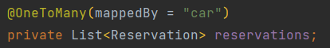

# Week 3
**- Where and why you have used a @OneToMany annotation**  

  
I have used @OneToMany annotation in the Member AND the Car Entity classes, this is because a member/car can have many reservations, but a reservation only refers to a single instance of Member or Car 
 

**- Where an why you have used a @ManyToOne annotation**  

  
I have used @ManyToOne annotation in the Reservation Entity class, this is because a reservation can only refer to a single instance of Member or Car, but a Member or Car can have many reservations
 

**- The purpose of the CascadeType, FetchType and mappedBy attributes you can use with one-to-many**
FetchType is used to specify how the data should be fetched from the database, the default is LAZY, which means that the data is fetched when it is needed. 
Eager means that the data is fetched immediately, which can be useful if you know that you will need the data later on.
 
CascadeType is used to specify what should happen to the data in the database when the data in the entity is changed.
  
mappedBy is used to indicate which field in the target entity is responsible for maintaining the relationship back to the source entity in a bidirectional relationship. 
 e.g. When you add a Reservation to the reservations list of a Member, it will automatically set the member field in the Reservation entity to the corresponding Member, and the relationship will be properly managed without needing additional configuration.
 

**- How/where you have (if done) added user defined queries to you repositories**
 
  
I have used it to find the average price of all cars in the database. 
same as doing this in Workbench:  

 

**- a few words, explaining what you had to do on your Azure App Service in order to make your Spring Boot App connect to your Azure MySqlDatabase**
 
Database is set up via the Azure portal, and the connection string is added to the application.properties file in the project.
These are then added to the Azure App Service via the Configuration tab, and the application is deployed to the App Service via the Deployment Center tab, using Github Actions. I think.. :)

**- a few words about where you have used inheritance in your project, and how it's reflected in your database**

  
Inheritance is used in reference to the security part of the project, 
where username, password & email are defined in the 'UserWithRole' class, and 'Member'
Entity extends 'UserWithRole' and inherits the username, password & email fields.
These are used in the Constructor of the Member entity, and are called using the super() method.

 

**- What are the pros & cons of using the Single Table Strategy for inheritance?**

Not sure. 

  

**- how are passwords stored in the database with the changes suggested in part-6 of the exercise**
It is stored in a hashed format, using the BCryptPasswordEncoder() method. 
instead of storing it insecurely in plain text.
